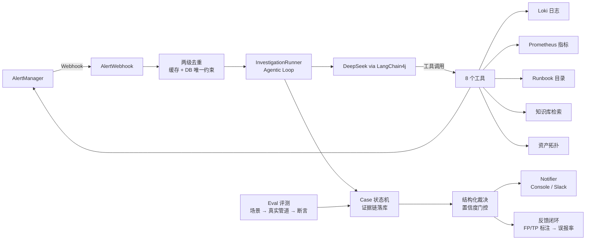

# AI Ops Agent（Java）

一体化的排障 Agent： **日志 / 指标 / 告警 / 知识库 / Runbook / 故障定位** ，
架构参考 [HolmesGPT](https://github.com/HolmesGPT/holmesgpt)（CNCF SRE Agent），技术栈为 Java。

**核心机制**（与 HolmesGPT 一致的三条设计）：

1. **Agentic Loop**：LLM 多轮调用工具（查日志 → 查指标 → 查 runbook → 汇总裁决），而不是一次性问答。
2. **Toolset**：查日志 / 指标 / 告警 / runbook / 知识库 / 拓扑 全部封装为带 JSON Schema 的工具，由 LLM 自主决定"查什么"。
3. **反馈闭环**：每次调查的人工标注（误报 / 真故障 / 已解决）落库，支撑误报率统计与后续调优。

## 架构



## 技术栈

| 组件 | 选型 |
|---|---|
| 运行时 | Java 21 + Spring Boot 3.4 |
| Agent / LLM | LangChain4j 1.x + DeepSeek（OpenAI 兼容 API，可换任意兼容模型） |
| 编排 | 手动工具调用循环（显式步数/超时/预算控制 + LLM 重试），后续可升级 Temporal |
| 日志 | Loki（HTTP LogQL） |
| 指标 | Prometheus（PromQL） |
| 告警 | AlertManager Webhook / API v2 |
| 状态存储 | PostgreSQL（JPA） |
| 去重缓存 | Redis（可选，默认内存） |
| 知识库 | Markdown 目录 + **RAG 混合检索**（关键词 TF + pgvector 语义向量，OpenAI 兼容 embedding，自动回退） |
| 评测 | Eval 场景集（evals/scenarios/*.json）+ 断言评估 + Markdown 报告 |
| CI | GitHub Actions（mvnw 自举构建 + 测试） |

## 快速开始

### 1. 启动可观测性底座（dev）

```bash
docker compose up -d
```

- Prometheus: http://localhost:9090
- AlertManager: http://localhost:9093
- Loki: http://localhost:3100
- Grafana: http://localhost:3000 (admin/admin)
- PostgreSQL: localhost:5432 (aops/aops)
- Redis: localhost:6379

### 2. 配置 LLM 并启动 Agent

```bash
set DEEPSEEK_API_KEY=sk-xxxx          # 或 export（Linux/macOS）
.\mvnw.cmd spring-boot:run            # 首次运行会自动下载 Maven 与依赖
```

> **影子模式（Shadow Mode）**：不设置 API Key 也能启动——告警照常接入、去重、建 Case，
> 但跳过 LLM 调查并生成占位报告，适合先验证管道。设置 `AOPS_AGENT_ENABLED=false` 同理。

### 3. 触发一个告警（手动测试）

```bash
curl -X POST http://localhost:8080/api/alerts/simple -H "Content-Type: application/json" -d "{
  \"alertName\": \"DemoAppDown\",
  \"status\": \"firing\",
  \"labels\": {\"service\": \"demo-app\", \"severity\": \"warning\"},
  \"annotations\": {\"summary\": \"demo app is down\"},
  \"startsAt\": \"2025-01-01T10:00:00Z\"
}"
```

查看调查结果：

```bash
curl http://localhost:8080/api/cases
curl http://localhost:8080/api/cases/<caseId>     # 详情 + 证据链 + 报告
curl http://localhost:8080/api/info               # 工具清单 / 数据规模 / 模式
```

### 4. 反馈（误报标注）

```bash
curl -X POST http://localhost:8080/api/cases/<caseId>/feedback -H "Content-Type: application/json" -d '{"outcome":"FALSE_POSITIVE","comment":"部署抖动，指标正常"}'
curl http://localhost:8080/api/feedback/stats     # 每告警规则误报率
```

## API 一览

| 方法 | 路径 | 说明 |
|---|---|---|
| POST | `/api/alerts` | AlertManager Webhook 标准格式（去重 → 建 Case → 异步调查） |
| POST | `/api/alerts/simple` | 单条告警 JSON（手动测试 / 非 AlertManager 源） |
| GET | `/api/cases` | 最近 50 个 Case |
| GET | `/api/cases/{id}` | Case 详情（含证据链 / 反馈 / 报告 Markdown） |
| POST | `/api/cases/{id}/reinvestigate` | 重新调查 |
| POST | `/api/cases/{id}/feedback` | 人工反馈（TRUE_POSITIVE / FALSE_POSITIVE / RESOLVED / UNCERTAIN） |
| GET | `/api/feedback/stats` | 每告警规则误报统计 |
| GET | `/api/info` | 运行时信息（工具清单 / 模型 / 数据规模） |

## 核心机制说明

### 三层机制

1. **资产拓扑注入（确定性）**：告警里的 `service` 标签 → 查 `config/topology.json`
   得到该服务的日志选择器、指标命名空间、runbook、依赖，直接注入提示词
2. **提示词启发式**：Error-Rate 告警先查错误日志；CPU 告警先查指标定位容器；Down 告警先查部署窗口。
3. **动态预算**：步数上限（`aops.agent.max-steps`）、工具输出截断、fast model 摘要（`summarize_output` 工具）。

### 人工接管

调查结束后自动裁决：`needsHuman=true` 或置信度 < 0.6 或 `INCONCLUSIVE` → Case 状态为
`ESCALATED` 并附升级原因；需要写操作（重启/回滚）默认就属于必须人工的场景。
升级通知（Slack）会附证据链摘要，让人 30 秒内接手。

### 误报处理（三层防线 + 数据飞轮）

1. **确定性层**：告警去重（fingerprint + 时间窗，Redis/内存）、部署窗口关联（`config/deploys.json`）。
2. **LLM 裁决层**：证据冲突检测（如"告警说 CPU 高但指标空闲"→ `LIKELY_FALSE_POSITIVE`），
   结构化裁决 `{verdict, confidence, ...}`。
3. **人工确认 + 飞轮**：反馈标注 → `FALSE_POSITIVE` 状态沉淀 → 每规则误报率报表 → 阈值调优建议。

### RAG 知识库

`search_kb` 工具走**混合检索**：关键词 TF 打分 + pgvector 语义向量（余弦相似度）加权合并
（`vector-weight` 默认 0.6）。启动时自动对 `config/kb/` 与 `config/runbooks/` 全部文档
切块（按标题/段落 + 重叠）并向量化写入 `kb_chunks` 表。

```bash
# 配置（任意 OpenAI 兼容 embedding API，如硅基流动 bge-m3、阿里 text-embedding-v3）
set AOPS_KB_EMBEDDING_ENABLED=true
set AOPS_KB_EMBEDDING_API_KEY=sk-xxx
set AOPS_KB_EMBEDDING_BASE_URL=https://api.siliconflow.cn/v1
set AOPS_KB_EMBEDDING_MODEL=BAAI/bge-m3
```

- 语义检索：查"连接被拒"也能命中写 `connection refused` 的文档（跨语言/同义词）；
- 优雅降级：未配置 embedding 时自动回退关键词检索（`/api/info` 的 `kbMode` 显示
  `hybrid` / `keyword-fallback` / `keyword`）；
- 文档更新后手动重建索引：`POST /api/kb/reindex`。

### 多 Agent 调查模式

单 Agent 模式（默认）之外，可切换到 **Supervisor + 专业 Agent** 并行调查：

```
alert ──► [log_analyst]      (search_logs / get_log_labels)      ─┐
       ──► [metric_analyst]  (query_metric)                        ├─ 并行(线程池) ──► Supervisor 综合 ──► 裁决
       ──► [knowledge_analyst] (kb / runbook / topology / 部署窗口) ┘
```

- 每个专业 Agent 使用**窄工具集 + 角色提示词**（token 预算隔离），自己的小步数预算；
- 所有工具调用仍落入同一 Case 的证据链（线程安全）；
- Supervisor 综合三路发现，输出标准裁决 JSON（与单模式完全兼容：Eval/通知/状态机不变）；
- 共享 `AgentLoop` 保证两种模式的重试/超时/预算行为一致；
- 演示场景：`cascade-payment-db`（payment-api 超时 → 下游 db-primary 慢查询的级联故障）。

```powershell
set AOPS_AGENT_MODE=supervisor
```

## 配置

全部通过环境变量覆盖（见 `src/main/resources/application.yml`）：

| 变量 | 默认 | 说明 |
|---|---|---|
| `DEEPSEEK_API_KEY` | - | LLM API Key（不设则进入影子模式） |
| `DEEPSEEK_MODEL` | `deepseek-chat` | 主调查模型 |
| `DEEPSEEK_BASE_URL` | `https://api.deepseek.com` | 任意 OpenAI 兼容端点 |
| `AOPS_FAST_MODEL` | `deepseek-chat` | fast model（摘要/轻任务） |
| `LOKI_URL` / `PROMETHEUS_URL` / `ALERTMANAGER_URL` | localhost:3100/9090/9093 | 数据源地址 |
| `AOPS_TOPOLOGY_FILE` | `config/topology.json` | 资产拓扑文件 |
| `AOPS_RUNBOOK_DIR` / `AOPS_KB_DIR` | `config/runbooks` / `config/kb` | runbook / 知识库目录 |
| `AOPS_DEDUP_MODE` | `memory` | `memory` 或 `redis` |
| `AOPS_NOTIFIER_TYPE` | `console` | `console` 或 `slack`（配 `SLACK_WEBHOOK_URL`） |
| `AOPS_AGENT_ENABLED` | `true` | 关闭则影子模式 |

## 目录结构

```
ai-ops-agent/
├── docker-compose.yaml            # dev 可观测性底座
├── config/
│   ├── prometheus/  alertmanager/  loki/   # 底座配置（含演示告警规则）
│   ├── topology.json              # 资产拓扑（查哪些日志的地基）
│   ├── runbooks/                  # runbook 目录（YAML frontmatter + markdown）
│   ├── kb/                        # 知识库目录
│   └── deploys.json               # 部署窗口事件（可选）
└── src/main/java/com/aops/agent/
    ├── agent/       # InvestigationRunner（agentic loop）/ 提示词 / 裁决提取 / 报告
    ├── tool/        # Tool 抽象 + ToolRegistry/ToolExecutor + 8 个核心工具
    ├── client/      # Loki / Prometheus / AlertManager HTTP 客户端
    ├── service/     # Topology / Runbook / KB / Dedup / Case 状态机 / Feedback
    ├── domain/      # Case / Evidence / Feedback / AlertEvent / Verdict
    ├── notifier/    # Console / Slack 通知抽象
    ├── web/         # 告警 Webhook / Case / Feedback / Info 接口
    └── config/      # 配置属性 + LLM 工厂
```
